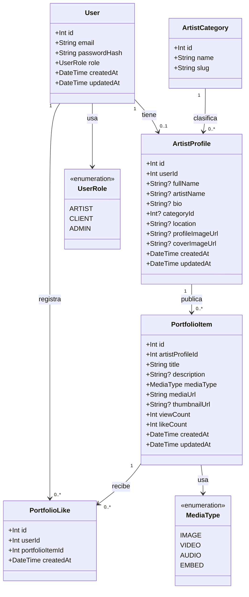
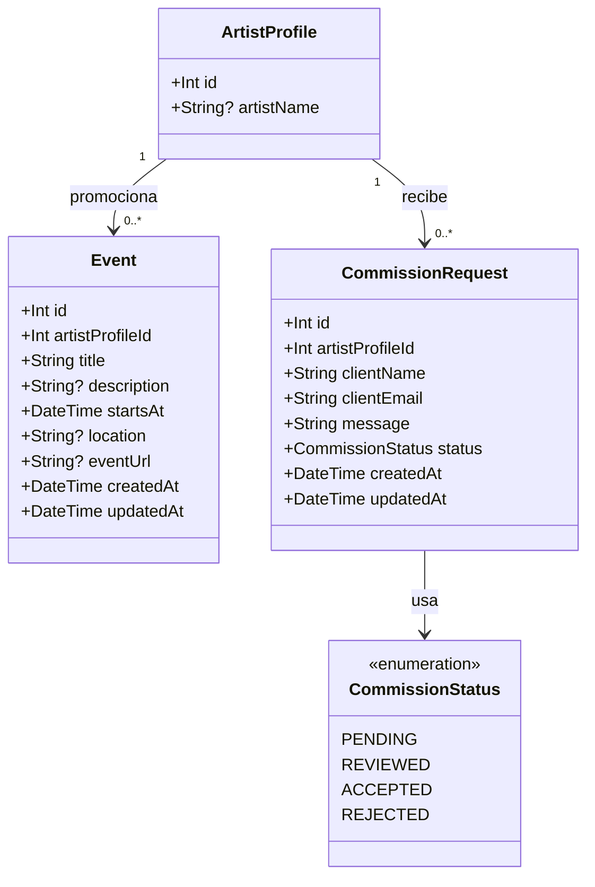

# Modelos de datos de Atrium

Este documento resume los modelos de datos principales de Atrium. La primera parte muestra lo que ya esta implementado en Prisma y MySQL. La segunda parte muestra los modelos planeados para completar el MVP.

## Modelo actual implementado



## Modelo relacional actual

```mermaid
erDiagram
  User ||--o| ArtistProfile : tiene
  ArtistCategory ||--o{ ArtistProfile : clasifica
  ArtistProfile ||--o{ PortfolioItem : publica
  User ||--o{ PortfolioLike : registra
  PortfolioItem ||--o{ PortfolioLike : recibe

  User {
    Int id PK
    String email UK
    String passwordHash
    UserRole role
    DateTime createdAt
    DateTime updatedAt
  }

  ArtistProfile {
    Int id PK
    Int userId FK_UK
    String fullName
    String artistName
    String bio
    Int categoryId FK
    String location
    String profileImageUrl
    String coverImageUrl
    DateTime createdAt
    DateTime updatedAt
  }

  ArtistCategory {
    Int id PK
    String name UK
    String slug UK
  }

  PortfolioItem {
    Int id PK
    Int artistProfileId FK
    String title
    String description
    MediaType mediaType
    String mediaUrl
    String thumbnailUrl
    Int viewCount
    Int likeCount
    DateTime createdAt
    DateTime updatedAt
  }

  PortfolioLike {
    Int id PK
    Int userId FK
    Int portfolioItemId FK
    DateTime createdAt
  }
```

## Explicacion de cada modelo

### User

Representa la cuenta privada del sistema.

Responsabilidades:

- guardar el email del usuario
- guardar la contrasena hasheada en `passwordHash`
- guardar el rol con `UserRole`
- servir como identidad para login y rutas protegidas

No se usa como perfil publico porque una cuenta y una identidad artistica no tienen la misma responsabilidad.

### ArtistProfile

Representa el perfil publico del artista.

Responsabilidades:

- guardar nombre completo en `fullName`
- guardar nombre artistico opcional en `artistName`
- guardar biografia, ubicacion, foto de perfil y portada
- conectar el perfil con una categoria artistica
- conectar el perfil con sus obras

Relacion importante:

```text
User 1 -> 0..1 ArtistProfile
```

Esto permite que en el futuro existan usuarios que no sean artistas, como clientes o administradores.

### ArtistCategory

Representa una categoria artistica controlada.

Ejemplos:

- Musica
- Danza
- Artes visuales
- Arte digital
- Fotografia
- Teatro
- Literatura
- Cine y video
- Diseno
- Artes escenicas

Responsabilidades:

- evitar categorias escritas libremente
- mejorar filtros en el frontend
- mantener consistencia en la base de datos

### PortfolioItem

Representa una obra del portafolio de un artista.

Responsabilidades:

- guardar titulo y descripcion
- indicar el tipo de medio con `MediaType`
- guardar la URL del archivo en `mediaUrl`
- guardar miniatura en `thumbnailUrl`
- registrar vistas con `viewCount`
- registrar me gusta con `likeCount`

Relacion importante:

```text
ArtistProfile 1 -> 0..* PortfolioItem
```

Un artista puede publicar muchas obras, pero cada obra pertenece a un solo perfil artistico.

### PortfolioLike

Representa el me gusta de un usuario sobre una obra.

Responsabilidades:

- conectar un usuario con una obra
- evitar likes repetidos
- permitir que el boton funcione como toggle: dar me gusta o quitar me gusta

Regla importante en Prisma:

```prisma
@@unique([userId, portfolioItemId])
```

Esto evita que un mismo usuario pueda crear dos likes sobre la misma obra.

## Enums actuales

### UserRole

Define los tipos de usuario permitidos.

```text
ARTIST
CLIENT
ADMIN
```

Actualmente el flujo principal trabaja con artistas, pero los roles permiten crecer hacia clientes o administradores.

### MediaType

Define los tipos de contenido permitidos en una obra.

```text
IMAGE
VIDEO
AUDIO
EMBED
```

Actualmente el flujo mas trabajado es `IMAGE`, pero el modelo deja espacio para videos, audio y embeds de plataformas externas.

## Modelos planeados para el MVP

Estos modelos todavia no estan implementados, pero forman parte del alcance planificado para semana 8, 9 y 10.



## Entidades futuras

### Event

Representara eventos promocionados por artistas.

Ejemplos:

- conciertos
- exposiciones
- lanzamientos
- talleres
- presentaciones

Relacion esperada:

```text
ArtistProfile 1 -> 0..* Event
```

### CommissionRequest

Representara solicitudes de comision enviadas por visitantes o clientes.

Responsabilidades:

- guardar nombre y correo del cliente
- guardar mensaje de solicitud
- relacionar la solicitud con un artista
- controlar el estado de la solicitud

Relacion esperada:

```text
ArtistProfile 1 -> 0..* CommissionRequest
```

### CommissionStatus

Permitira controlar el estado de una solicitud.

```text
PENDING
REVIEWED
ACCEPTED
REJECTED
```

## Resumen para explicar oralmente

El modelo de datos separa la cuenta privada del usuario y el perfil publico del artista. `User` maneja autenticacion, mientras que `ArtistProfile` maneja la informacion visible del artista. Las obras se guardan en `PortfolioItem`, las categorias se controlan mediante `ArtistCategory` y los likes se registran en `PortfolioLike` para evitar duplicados. Esta estructura permite que Atrium funcione como una plataforma de portafolios y tambien deja espacio para crecer hacia comisiones y eventos.
