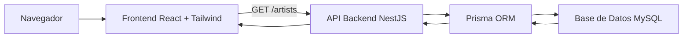

# Plan de Base de Datos de Atrium

## Modelos principales

### User

Representa una cuenta registrada en Atrium.

Campos:
- id
- email
- passwordHash
- role
- createdAt
- updatedAt

### ArtistProfile

Representa el perfil público de un artista o creativo.

Campos:
- id
- userId
- displayName
- bio
- category
- location
- profileImageUrl
- createdAt
- updatedAt

Relación:
- Un User tiene un ArtistProfile.
- Un ArtistProfile pertenece a un User.

### PortfolioItem

Representa una obra creativa publicada por un artista.

Campos:
- id
- artistProfileId
- title
- description
- mediaType
- mediaUrl
- thumbnailUrl
- createdAt
- updatedAt

Tipos de media:
- IMAGE
- VIDEO
- AUDIO
- EMBED

Relación:
- Un ArtistProfile tiene muchos PortfolioItems.
- Un PortfolioItem pertenece a un ArtistProfile.

Notas:
- Para el MVP, los medios del portafolio usarán URLs externas o embeds.
- Las cargas con Cloudinary se pueden agregar después de que el flujo básico de portafolio funcione.

## Modelos posteriores

### Event

Representa un evento promocionado por un artista.

### CommissionRequest

Representa una solicitud de un visitante o cliente para contratar a un artista.

### Like

Representa que un usuario le dio like a un PortfolioItem.

### View

Representa el conteo de vistas de un PortfolioItem.

## Diagrama de Arquitectura

