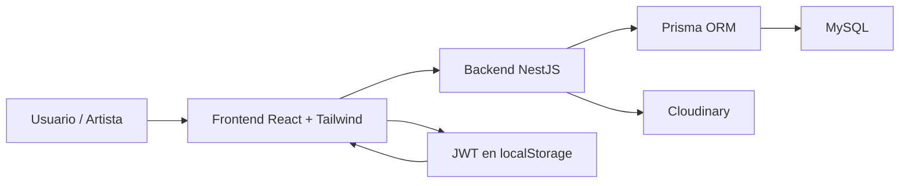
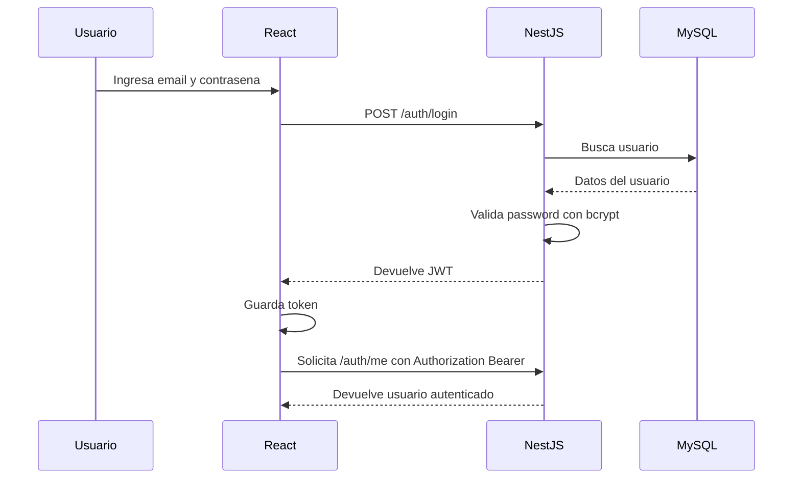
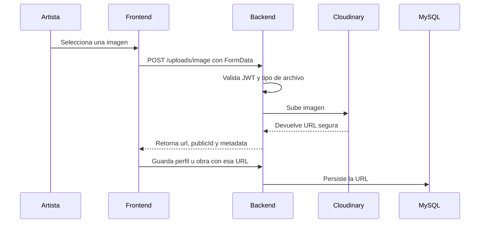

# Entrega técnica - Semana 7

## Proyecto

**Atrium** es una plataforma multimedia para artistas y creativos. Permite que un artista cree una cuenta, configure su perfil publico, publique obras en un portafolio, suba imagenes reales y reciba interaccion mediante vistas y me gusta.

## Objetivo de la entrega

Presentar el avance tecnico inicial del proyecto, evidenciando:

- analisis del problema
- planificacion de la solucion
- diseno tecnico
- primeras evidencias de implementacion
- tecnologias seleccionadas y su justificacion

## 1. Identificación del problema u oportunidad

Muchos artistas emergentes muestran su trabajo en redes sociales generales. Esto causa varios problemas:

- el portafolio queda disperso entre publicaciones personales
- no siempre existe una pagina clara para ver sus obras principales
- es dificil separar identidad artistica, obras, eventos y posibles solicitudes de comision
- las plataformas generales no estan disenadas especificamente para descubrir talento artistico local o creativo

Atrium propone una solucion enfocada en artistas, donde cada creador puede tener un perfil publico, publicar obras multimedia y centralizar su presencia profesional.

## 2. Requerimientos principales identificados

### Requerimientos funcionales implementados

- Registro de usuario artista.
- Inicio de sesion con JWT.
- Dashboard privado para el artista.
- Edicion de perfil publico.
- Subida de foto de perfil y portada con Cloudinary.
- Publicacion de obras en el portafolio.
- Subida de imagenes reales para obras.
- Home con listado de artistas y obras.
- Filtro por categoria artistica.
- Pagina publica de artista.
- Pagina individual de obra.
- Conteo de vistas.
- Sistema de me gusta limitado por usuario.

### Requerimientos funcionales pendientes para el MVP

- Solicitudes de comision.
- Promocion de eventos.
- Edicion y eliminacion de obras.
- Validaciones mas completas en formularios.
- Mejor manejo de errores.
- Pulido responsive.

### Requerimientos no funcionales considerados

- Seguridad basica mediante contrasenas hasheadas y JWT.
- Separacion clara entre frontend, backend y base de datos.
- Persistencia relacional con MySQL.
- Almacenamiento externo de imagenes usando Cloudinary.
- Arquitectura modular para facilitar mantenimiento.

## 3. Arquitectura de la solucion

El proyecto esta organizado como monorepo:

```text
atrium/
  backend/
  frontend/
  docs/
```

Se eligio monorepo porque facilita el desarrollo local del proyecto de graduacion. Permite mantener frontend, backend y documentacion en un mismo repositorio sin introducir la complejidad de microservicios.

### Diagrama de arquitectura



### Flujo de autenticacion



### Flujo de subida de imagenes



## 4. Diseno de datos actual

### Modelos principales

```mermaid
erDiagram
  User ||--o| ArtistProfile : tiene
  ArtistProfile ||--o{ PortfolioItem : publica
  ArtistCategory ||--o{ ArtistProfile : clasifica
  User ||--o{ PortfolioLike : registra
  PortfolioItem ||--o{ PortfolioLike : recibe

  User {
    Int id PK
    String email UK
    String passwordHash
    UserRole role
    DateTime createdAt
    DateTime updatedAt
  }

  ArtistProfile {
    Int id PK
    Int userId FK_UK
    String fullName
    String artistName
    String bio
    Int categoryId FK
    String location
    String profileImageUrl
    String coverImageUrl
  }

  ArtistCategory {
    Int id PK
    String name UK
    String slug UK
  }

  PortfolioItem {
    Int id PK
    Int artistProfileId FK
    String title
    String description
    MediaType mediaType
    String mediaUrl
    String thumbnailUrl
    Int viewCount
    Int likeCount
  }

  PortfolioLike {
    Int id PK
    Int userId FK
    Int portfolioItemId FK
    DateTime createdAt
  }
```

### Justificacion del modelo

- `User` representa la cuenta privada del sistema.
- `ArtistProfile` representa la identidad publica del artista.
- `ArtistCategory` evita categorias escritas libremente y mejora los filtros.
- `PortfolioItem` representa cada obra publicada.
- `PortfolioLike` evita que un usuario pueda dar varios me gusta a la misma obra mediante una restriccion unica.

## 5. Modulos implementados en backend

### AuthModule

Responsable de registro, login y autenticacion JWT.

Endpoints principales:

```text
POST /auth/register
POST /auth/login
GET /auth/me
```

### ArtistsModule

Responsable de perfiles publicos de artistas.

Endpoints principales:

```text
GET /artists
GET /artists/:id
PATCH /artists/me
```

### ArtistCategoriesModule

Responsable de listar categorias artisticas controladas.

Endpoint principal:

```text
GET /artist-categories
```

### PortfolioModule

Responsable de obras, detalle de obra, vistas y me gusta.

Endpoints principales:

```text
GET /portfolio
GET /portfolio/:id
POST /portfolio
GET /portfolio/:id/like-status
POST /portfolio/:id/like
```

### CloudinaryModule y UploadsModule

Responsables de subir imagenes reales a Cloudinary.

Endpoint principal:

```text
POST /uploads/image
```

Este endpoint esta protegido con JWT para que solo usuarios autenticados puedan subir archivos.

## 6. Funcionalidades visibles en frontend

- Home con artistas y obras.
- Filtro por categorias artisticas.
- Registro de artista.
- Inicio de sesion.
- Dashboard privado.
- Vista previa del perfil publico.
- Edicion de nombre, nombre artistico, bio y ubicacion.
- Subida de foto de perfil.
- Subida de portada.
- Creacion de obras con imagen real.
- Perfil publico tipo portafolio.
- Detalle de obra con imagen grande.
- Boton de me gusta.
- Conteo de vistas.

## 7. Justificacion tecnica

### React + Tailwind CSS

Se eligio para construir una interfaz rapida, modular y visualmente consistente. Tailwind permite mantener estilos directamente cerca del componente sin crear muchas hojas CSS separadas.

### NestJS

Se eligio porque organiza el backend en modulos, controladores y servicios. Esto ayuda a mantener una arquitectura limpia y facilita explicar el proyecto tecnicamente.

### MySQL

Se eligio porque el dominio del sistema tiene relaciones claras: usuarios, perfiles, obras, categorias, likes y futuras solicitudes de comision.

### Prisma ORM

Se eligio para trabajar con la base de datos usando modelos tipados, migraciones y consultas mas seguras que SQL manual.

### Cloudinary

Se eligio para almacenar imagenes reales fuera del servidor. Esto evita guardar archivos pesados localmente y permite obtener URLs optimizadas para mostrar en el frontend.

### JWT

Se eligio para proteger rutas privadas como dashboard, edicion de perfil, creacion de obras y subida de imagenes.

## 8. Evidencia de avance realizado

Evidencias que se deben mostrar en la presentacion:

- Home con artistas y obras.
- Dashboard del artista.
- Edicion de perfil.
- Preview del perfil publico.
- Perfil publico con foto y portada.
- Creacion de obra con imagen subida desde la computadora.
- Detalle de obra.
- Respuesta del endpoint de Cloudinary con `url`, `publicId`, `width`, `height`, `format` y `bytes`.
- Base de datos en MySQL Workbench mostrando tablas principales.

## 9. Estado actual del proyecto

### Avance del MVP

**62%**

El flujo principal del artista ya funciona:

```text
registrarse -> iniciar sesion -> editar perfil -> subir imagenes -> crear obra -> ver perfil publico -> interactuar con obras
```

### Preparacion para la entrega tecnica

**90% estimado**

La preparacion aumenta porque ya existe documentacion tecnica, diagramas, arquitectura clara y evidencias de implementacion funcional.

## 10. Pendientes y plan de trabajo

### Semana 7

- Cerrar documentacion de entrega.
- Tomar capturas de evidencia.
- Pulir dashboard visual.
- Confirmar flujo completo con una sola cuenta demo.

### Semana 8

- Implementar solicitudes de comision.
- Implementar promocion de eventos.
- Agregar edicion y eliminacion de obras.
- Fortalecer validaciones.

### Semana 9

- Pulido responsive.
- Correccion de errores.
- Pruebas manuales documentadas.
- Preparacion de demo final.
- Preparacion para preguntas de defensa.

## 11. Riesgos identificados

- Falta completar comisiones y eventos para cubrir todo el alcance original.
- Se deben mejorar validaciones de archivos, especialmente peso y formato.
- Se debe evitar subir secretos como `.env` o API secrets al repositorio.
- La interfaz necesita pulido responsive antes del MVP final.

## 12. Resumen para defender oralmente

Atrium ya tiene implementada la base tecnica principal de una plataforma para artistas. El sistema permite autenticacion, perfiles publicos, categorias, portafolio, subida real de imagenes con Cloudinary e interacciones mediante vistas y me gusta. La arquitectura se mantiene modular usando React en frontend, NestJS en backend, Prisma como ORM y MySQL como base de datos. Para las semanas restantes se priorizara completar comisiones, eventos, edicion de obras, validaciones y pulido visual.
