# Informe detallado del backend de Atrium

## 1. Resumen ejecutivo

Atrium es una plataforma multimedia para artistas, creativos y clientes. El backend no esta disenado como una API simple de portafolios, sino como una base de producto para varias lineas de negocio:

- identidad y autenticacion;
- perfiles publicos de artistas;
- portafolio creativo;
- comisiones privadas;
- bolsa de trabajo;
- pagos con PayPal Sandbox;
- entregas protegidas;
- notificaciones;
- correos transaccionales;
- reviews de artista y cliente;
- marketplace digital tipo Gumroad;
- panel administrador real.

La arquitectura actual esta basada en **NestJS**, **Prisma**, **MySQL**, **Cloudinary**, **PayPal Server SDK** y **Nodemailer/Resend**. Estas tecnologias fueron elegidas porque el producto necesita modulos separados, reglas de negocio complejas, manejo fuerte de relaciones, archivos multimedia externos, pagos y correo transaccional.

El backend esta organizado por dominios. Cada dominio tiene su modulo, controller, service y DTOs. Esto evita mezclar reglas de comisiones con reglas de marketplace, pagos, portafolio u ofertas.

Estado estimado del backend: **94% del producto ampliado**.

## 2. Stack tecnico y razon de cada tecnologia

### 2.1 NestJS

NestJS se usa como framework principal del backend.

Se eligio por estas razones:

- El producto tiene muchos dominios. NestJS permite separarlos en modulos.
- Permite inyeccion de dependencias, por ejemplo `PrismaService`, `MailService` o `CloudinaryService`.
- Tiene soporte natural para controllers, services, guards y modules.
- Facilita proteger rutas con `JwtAuthGuard`.
- Encaja bien con TypeScript.
- Escala mejor que un Express plano cuando el proyecto crece.

En Atrium, NestJS organiza el backend asi:

- `Controller`: recibe requests HTTP y llama al service.
- `Service`: contiene la logica de negocio.
- `Module`: agrupa controller, service y dependencias.
- `Guard`: protege rutas privadas.
- `DTO`: define la forma esperada del body.

Esta separacion hace que una regla de negocio importante, por ejemplo "el cliente no puede descargar archivo final antes de aprobar", viva en el service correcto y no dispersa en frontend.

### 2.2 TypeScript

TypeScript se usa para reducir errores en un dominio con muchos estados y relaciones.

Atrium maneja enums como:

- `UserRole`;
- `CommissionStatus`;
- `PaymentStatus`;
- `PaymentPurpose`;
- `JobPostStatus`;
- `JobApplicationStatus`;
- `DigitalProductStatus`;
- `DigitalProductAssetKind`;
- `DigitalProductPurchaseStatus`.

Sin TypeScript, estos estados serian strings sueltos y seria facil escribir un estado invalido. Con TypeScript y Prisma, muchas referencias quedan tipadas.

### 2.3 Prisma

Prisma es el ORM del proyecto.

Se eligio porque:

- centraliza el modelo de datos en `prisma/schema.prisma`;
- genera cliente tipado;
- simplifica relaciones complejas;
- permite migraciones versionadas;
- reduce SQL manual repetitivo;
- hace mas legibles consultas con `include`, `select`, `where` y `orderBy`.

Atrium necesita relaciones de varios niveles:

- usuario -> perfil artista;
- artista -> portafolio;
- artista -> comisiones;
- comision -> adjuntos;
- comision -> pagos;
- comision -> disputas;
- oferta -> aplicaciones;
- aplicacion aceptada -> comision;
- producto digital -> assets;
- producto digital -> compras.

Prisma permite expresar esas relaciones de forma directa.

### 2.4 MySQL

MySQL es la base de datos local.

Se eligio porque:

- es estable y conocida;
- soporta relaciones, indices y constraints;
- funciona bien con Prisma;
- es suficiente para un marketplace y plataforma transaccional de este tamano;
- se puede desplegar facilmente en servicios administrados.

El backend usa `@prisma/adapter-mariadb` con Prisma 7 para conectarse a MySQL/MariaDB mediante adapter explicito.

### 2.5 Cloudinary

Cloudinary maneja archivos y media.

Se usa para:

- imagenes de perfil;
- portadas;
- portafolio;
- adjuntos de comisiones;
- previews con watermark;
- archivos finales privados;
- productos digitales descargables.

La decision se hizo asi porque la base de datos no debe guardar binarios pesados. MySQL guarda metadata y Cloudinary guarda el archivo real.

Cloudinary tambien permite:

- transformaciones de imagen;
- URLs seguras;
- assets `authenticated`;
- descargas firmadas;
- previews con watermark.

### 2.6 PayPal Sandbox

PayPal se usa para pagos.

En comisiones:

- el artista genera una transaccion pendiente;
- PayPal crea una orden;
- el cliente paga;
- la comision pasa a `IN_PROGRESS`;
- el pago se libera logicamente cuando la entrega se aprueba.

En marketplace:

- el cliente compra producto digital;
- PayPal captura la orden;
- la compra pasa a `PAID`;
- se desbloquea descarga firmada.

PayPal Sandbox permite probar sin dinero real.

### 2.7 Nodemailer y Resend

El backend soporta dos vias para email:

- Resend mediante `RESEND_API_KEY`;
- SMTP mediante `SMTP_HOST`, `SMTP_USER`, `SMTP_PASS`.

Esto permite usar Mailtrap/SMTP en desarrollo y Resend en produccion.

El correo esta centralizado en `MailService` para no duplicar logica entre modulos.

## 3. Estructura del backend

Directorio principal:

```text
backend/
  prisma/
    schema.prisma
    migrations/
  src/
    app.module.ts
    main.ts
    auth/
    artists/
    artist-categories/
    cloudinary/
    commissions/
    digital-products/
    generated/
    job-posts/
    mail/
    notifications/
    payments/
    portfolio/
    prisma/
    reviews/
    uploads/
```

### 3.1 Archivos raiz importantes

`src/main.ts`

- Crea la app NestJS.
- Activa CORS.
- Usa `FRONTEND_URL`.
- Escucha en `PORT` o `3000`.

`src/app.module.ts`

- Registra todos los modulos.
- Es el punto de composicion de la aplicacion.

`prisma/schema.prisma`

- Define tablas, enums, relaciones e indices logicos.
- Es la fuente de verdad del modelo de datos.

`src/prisma/prisma.service.ts`

- Conecta Prisma con MySQL.
- Lee `DATABASE_URL`.
- Exporta `PrismaService` para todos los modulos.

## 4. Diagrama de arquitectura general

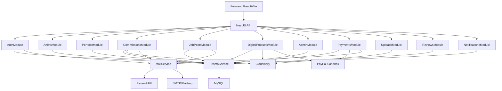

## 5. Diagrama de modulos NestJS

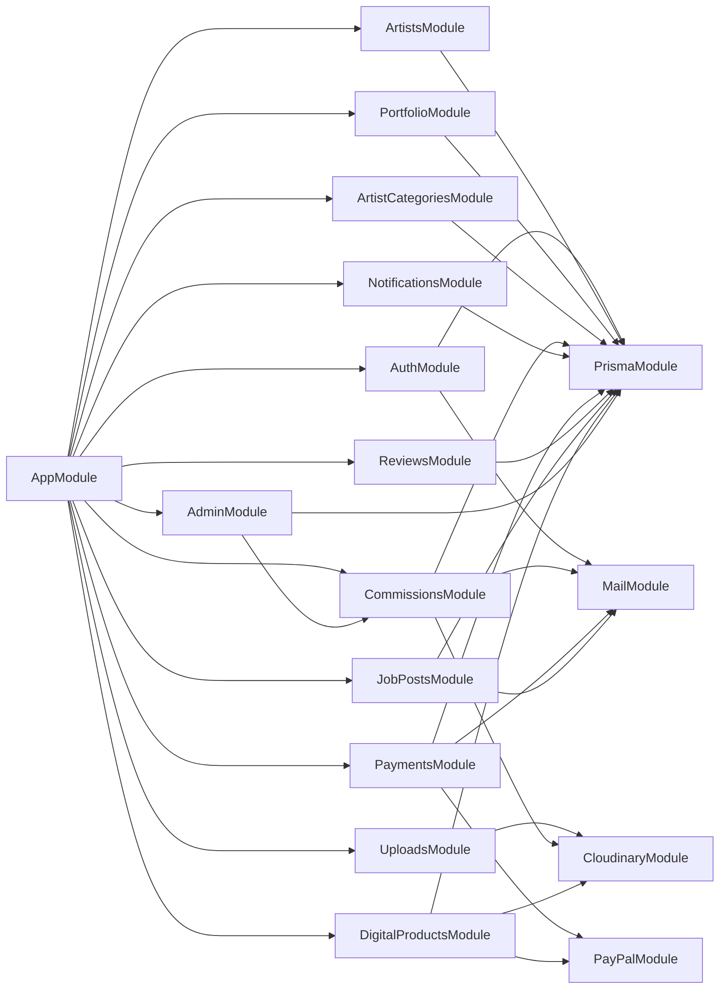

## 6. Modelo de datos completo

### 6.1 Diagrama ER general

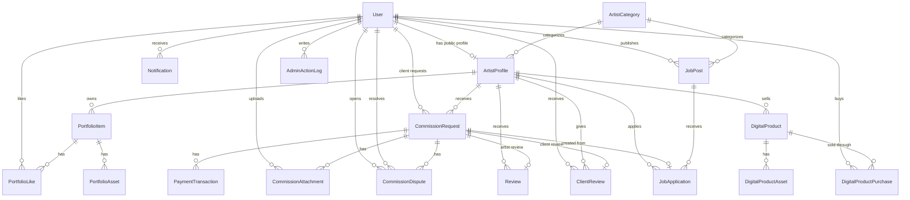

### 6.2 User

`User` representa la cuenta privada.

Campos importantes:

- `id`: identificador interno.
- `email`: unico.
- `fullName`: nombre general de la cuenta.
- `interests`: intereses del usuario, util para cliente o discovery.
- `googleId`: reservado para login con Google.
- `emailVerifiedAt`: confirma si la cuenta esta activada.
- `emailVerificationToken`: token temporal de verificacion.
- `emailVerificationExpiresAt`: vencimiento del token.
- `passwordHash`: contrasena hasheada.
- `role`: `ARTIST`, `CLIENT` o `ADMIN`.
- `isSuspended`: bloquea login y acceso por JWT cuando admin suspende una cuenta.

Relaciones:

- `profile`: perfil publico de artista.
- `portfolioLikes`: likes dados.
- `notifications`: notificaciones recibidas.
- `clientCommissionRequests`: comisiones solicitadas como cliente.
- `clientReviewsReceived`: reviews que recibe como cliente.
- `jobPosts`: ofertas que publica.
- `commissionAttachments`: archivos subidos.
- `openedCommissionDisputes`: disputas que abre.
- `resolvedCommissionDisputes`: disputas que resuelve como admin.
- `digitalProductPurchases`: compras de productos digitales.
- `adminActionLogs`: acciones administrativas realizadas.

Decision importante:

Un usuario puede tener perfil artistico y aun asi actuar como cliente. Por eso `ArtistProfile` esta separado de `User`. Esto permite que un artista publique ofertas, compre productos, solicite comisiones o venda productos digitales sin cambiar de cuenta.

### 6.3 ArtistProfile

`ArtistProfile` es la identidad publica del artista.

Campos:

- `userId`: relacion unica con `User`.
- `fullName`: nombre visible.
- `artistName`: nombre artistico.
- `bio`: biografia.
- `categoryId`: categoria normalizada.
- `location`: ubicacion.
- `profileImageUrl`: foto.
- `coverImageUrl`: portada.
- `commissionTypes`: tipos de comision.
- `startingPrice`: precio base.
- `servicePriceRange`: rango.
- `serviceMode`: online, presencial o ambos.
- `serviceArea`: zona.
- `serviceDescription`: descripcion de servicios.
- `interests`: intereses.
- `isHidden`: oculta el perfil de listados publicos sin borrar datos.

Relaciones:

- `portfolioItems`;
- `commissionRequests`;
- `reviews`;
- `clientReviewsGiven`;
- `jobApplications`;
- `digitalProducts`.

Por que se hizo asi:

La cuenta privada y el perfil publico tienen ciclos de vida distintos. La cuenta necesita email, password y rol. El perfil necesita bio, categoria, imagenes, portfolio y servicios. Separarlos evita mezclar datos de seguridad con datos publicos.

### 6.4 ArtistCategory

Normaliza categorias artisticas.

Campos:

- `name`;
- `slug`.

Relaciones:

- `profiles`;
- `jobPosts`.

Por que se hizo asi:

Permite filtros consistentes. Evita que existan variaciones como `Ilustracion`, `ilustracion`, `Ilustracion digital` para la misma categoria.

### 6.5 PortfolioItem, PortfolioAsset y PortfolioLike

`PortfolioItem` representa una obra.

Campos:

- `artistProfileId`;
- `title`;
- `description`;
- `mediaType`;
- `mediaUrl`;
- `thumbnailUrl`;
- `viewCount`;
- `likeCount`.
- `isHidden`.

`PortfolioAsset` representa cada archivo dentro de una obra.

Campos:

- `portfolioItemId`;
- `mediaType`: `IMAGE`, `VIDEO` o `PDF`;
- `url`;
- `thumbnailUrl`;
- `publicId`;
- `resourceType`;
- `deliveryType`;
- `name`;
- `mimeType`;
- `size`;
- `sortOrder`.

`PortfolioLike` guarda likes por usuario.

Constraint:

```prisma
@@unique([userId, portfolioItemId])
```

Por que se hizo asi:

El unique evita likes duplicados. `likeCount` se guarda denormalizado para listar obras rapido sin contar likes en cada request. La relacion con `PortfolioLike` mantiene trazabilidad real de quien dio like.

`PortfolioItem` conserva `mediaType`, `mediaUrl` y `thumbnailUrl` como portada tecnica y compatibilidad con listados existentes. `PortfolioAsset` guarda el contenido real completo: varias imagenes, videos y PDFs en una sola publicacion.

Se quitaron `AUDIO` y `EMBED` porque no habia upload ni render real para esos tipos. Menos estados falsos significa menos ramas muertas en frontend y backend.

`isHidden` permite moderar una obra desde admin sin destruir historial, likes ni relaciones.

### 6.6 CommissionRequest

Es el modelo central de comisiones.

Agrupa:

- cliente;
- artista;
- brief;
- presupuesto;
- propuesta;
- pago;
- entrega;
- revisiones;
- cancelacion;
- disputa;
- cierre;
- reviews.

Campos importantes:

- `artistProfileId`: artista receptor.
- `clientUserId`: usuario cliente si esta registrado.
- `clientName`, `clientEmail`: snapshot de cliente.
- `projectTitle`: titulo del proyecto.
- `message`: brief.
- `budget`, `budgetMin`, `budgetMax`: presupuesto.
- `desiredDeadline`: fecha deseada.
- `isFlexibleDeadline`: indica si la fecha es flexible.
- `serviceMode`: modalidad.
- `artistNote`: nota interna del artista.
- `artistResponse`: propuesta.
- `quotedPrice`: precio propuesto.
- `rejectionReason`: motivo de rechazo.
- `deliveryMessage`: mensaje de entrega.
- `deliveryUrl`: link de entrega heredado.
- `deliveryPreviewUrl`: preview protegido.
- `finalFileUrl`: link final heredado.
- `includedRevisions`: revisiones incluidas.
- `usedRevisions`: revisiones usadas.
- `extraRevisionPrice`: precio revision extra.
- `cancellationRetentionPercent`: porcentaje retenido si cliente cancela despues de entrega.
- `cancelledByUserId`;
- `cancelledAt`;
- `cancellationReason`;
- `clientResponseDeadline`;
- `autoApprovedAt`;
- `revisionRequest`;
- `deliveredAt`;
- `completedAt`;
- `status`.

Relaciones:

- `artistProfile`;
- `clientUser`;
- `paymentTransactions`;
- `review`;
- `clientReview`;
- `jobApplication`;
- `attachments`;
- `disputes`.

Por que se hizo asi:

Una comision tiene una maquina de estados real. No basta con `created` y `paid`. Hay negociacion, aceptacion, pago, trabajo, entrega, revision, cancelacion, disputa y cierre. Centralizarlo en `CommissionRequest` permite auditar el ciclo completo.

### 6.7 CommissionStatus

Estados:

- `PENDING`: solicitud inicial.
- `REVIEWED`: artista la puso en revision.
- `PROPOSED`: artista envio propuesta.
- `CLIENT_ACCEPTED`: cliente acepto propuesta.
- `CLIENT_REJECTED`: cliente rechazo propuesta.
- `ACCEPTED`: artista confirmo comision.
- `PAYMENT_PENDING`: pago generado.
- `IN_PROGRESS`: pago completado, artista trabaja.
- `DELIVERED`: artista entrego preview/final.
- `REVISION_REQUESTED`: cliente pidio cambios.
- `COMPLETED`: cliente aprobo o se autoaprobo.
- `REJECTED`: artista rechazo.
- `CANCELLED_BY_CLIENT`: cliente cancelo.
- `CANCELLED_BY_ARTIST`: artista cancelo.
- `DISPUTED`: hay disputa abierta.

Por que se hizo asi:

Cada estado habilita o bloquea acciones. Esto protege el flujo en backend aunque el frontend tenga errores.

### 6.8 CommissionAttachment

Tipos:

- `CLIENT_REFERENCE`;
- `ARTIST_PREVIEW`;
- `ARTIST_FINAL`;
- `DISPUTE_EVIDENCE`.

Campos:

- `url`;
- `publicId`;
- `resourceType`;
- `deliveryType`;
- `previewUrl`;
- `name`;
- `mimeType`;
- `size`;
- `uploadedByUserId`.

Por que se hizo asi:

Se necesitaban varios archivos por comision. Un solo `deliveryPreviewUrl` y un solo `finalFileUrl` no bastan para proyectos reales. El modelo permite referencias multiples, varias entregas preview, archivos finales privados y evidencias de disputa.

### 6.9 CommissionDispute

Representa una disputa formal.

Campos:

- `commissionRequestId`;
- `openedByUserId`;
- `resolvedByUserId`;
- `reason`;
- `status`;
- `resolution`;
- `resolvedAt`.

Por que se hizo asi:

Las disputas necesitan trazabilidad. No basta con cambiar estado de comision. Hay que saber quien abrio, por que, quien resolvio y cual fue la resolucion.

### 6.10 PaymentTransaction

Representa pagos de comisiones y revisiones extra.

Campos:

- `commissionRequestId`;
- `amount`;
- `currency`;
- `status`;
- `purpose`;
- `description`;
- `provider`;
- `providerOrderId`;
- `releasedAt`.

`purpose` puede ser:

- `COMMISSION`;
- `REVISION_EXTRA`.

Por que se hizo asi:

El pago de comision no es una compra digital inmediata. Tiene logica de proteccion y liberacion. Por eso `releasedAt` marca cuando el pago queda logicamente liberado tras aprobacion.

### 6.11 JobPost y JobApplication

`JobPost` representa una oferta de trabajo.

Campos:

- `clientUserId`;
- `title`;
- `description`;
- `categoryId`;
- `budgetMin`;
- `budgetMax`;
- `desiredDeadline`;
- `isFlexibleDeadline`;
- `serviceMode`;
- `location`;
- `status`.

Estados:

- `OPEN`;
- `IN_REVIEW`;
- `PAUSED`;
- `ASSIGNED`;
- `CLOSED`.

`JobApplication` representa una aplicacion de artista.

Campos:

- `jobPostId`;
- `artistProfileId`;
- `commissionRequestId`;
- `message`;
- `proposedPrice`;
- `estimatedTimeline`;
- `portfolioLinks`;
- `status`.

Estados:

- `PENDING`;
- `SHORTLISTED`;
- `ACCEPTED`;
- `REJECTED`;
- `WITHDRAWN`.

Por que se hizo asi:

La bolsa de trabajo es distinta a una solicitud directa de comision. En una oferta pueden aplicar varios artistas. Solo cuando el cliente acepta una aplicacion, el sistema crea una `CommissionRequest`. Esto mantiene separado el proceso de seleccion del proceso de ejecucion.

### 6.12 DigitalProduct, DigitalProductAsset, DigitalProductPurchase

Estos modelos soportan el marketplace digital.

`DigitalProduct`:

- artista vendedor;
- titulo;
- descripcion;
- precio;
- moneda;
- cover;
- estado.

Estados:

- `DRAFT`;
- `PUBLISHED`;
- `ARCHIVED`.

`DigitalProductAsset`:

- `PREVIEW`: visible para venta;
- `DOWNLOAD`: archivo privado para compradores.

`DigitalProductPurchase`:

- comprador;
- producto;
- monto;
- estado;
- PayPal order id;
- fecha de pago.

Por que se hizo asi:

El marketplace no usa `PaymentTransaction` porque las reglas son distintas. Una comision tiene pago retenido y liberacion posterior. Un producto digital se desbloquea inmediatamente al pagar. Separar `DigitalProductPurchase` evita acoplar dos negocios distintos.

### 6.13 AdminActionLog

`AdminActionLog` guarda acciones sensibles realizadas por administradores.

Campos:

- `adminUserId`;
- `action`;
- `targetType`;
- `targetId`;
- `metadata`;
- `createdAt`.

Por que se hizo asi:

Las acciones administrativas no deben quedar solo en memoria o en logs de consola. Suspender usuarios, ocultar artistas, cerrar ofertas o resolver disputas cambia el negocio. Este modelo deja rastro auditable sin crear todavia un sistema de compliance pesado.

### 6.14 Review y ClientReview

`Review`: cliente califica artista.

`ClientReview`: artista califica cliente.

Ambas requieren comision completada.

Por que se hizo asi:

Atrium busca proteger ambos lados. El artista necesita reputacion publica, pero el cliente tambien debe construir historial para que los artistas puedan evaluar con quien trabajan.

### 6.15 Notification

Guarda notificaciones internas.

Tipos actuales:

- `COMMISSION_REQUEST`;
- `PORTFOLIO_LIKE`;
- `FOLLOW`;
- `MESSAGE`.

Por que se hizo asi:

El producto necesita feedback dentro de la app, no solo correo. Las notificaciones permiten dashboards mas activos y reducen dependencia del email.

## 7. Flujos UML principales

### 7.1 Registro y verificacion de correo

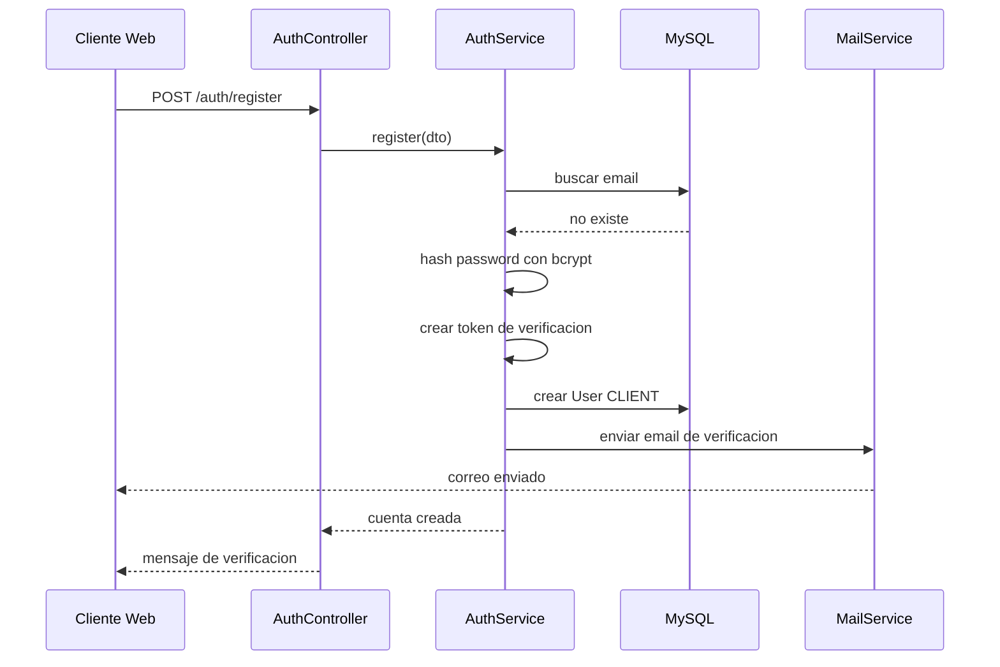

### 7.2 Login con JWT

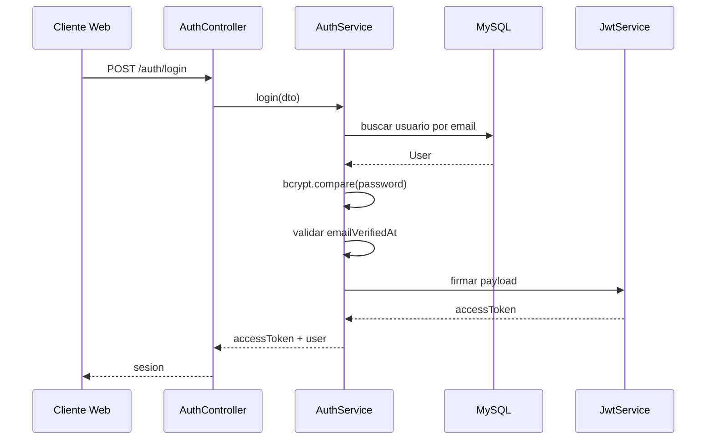

### 7.3 Solicitud de comision

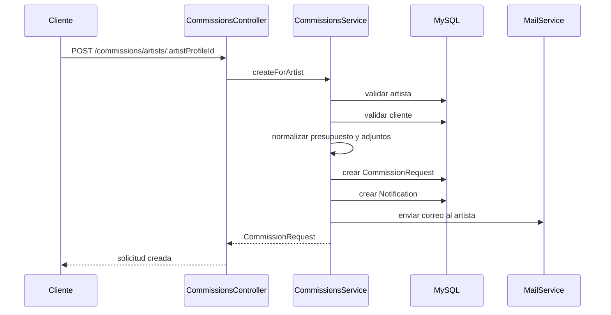

### 7.4 Flujo de comision pagada

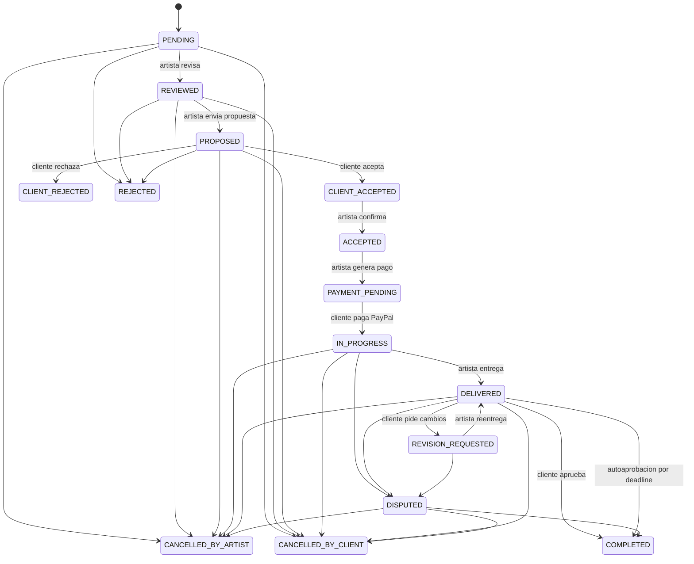

### 7.5 Pago de comision con PayPal

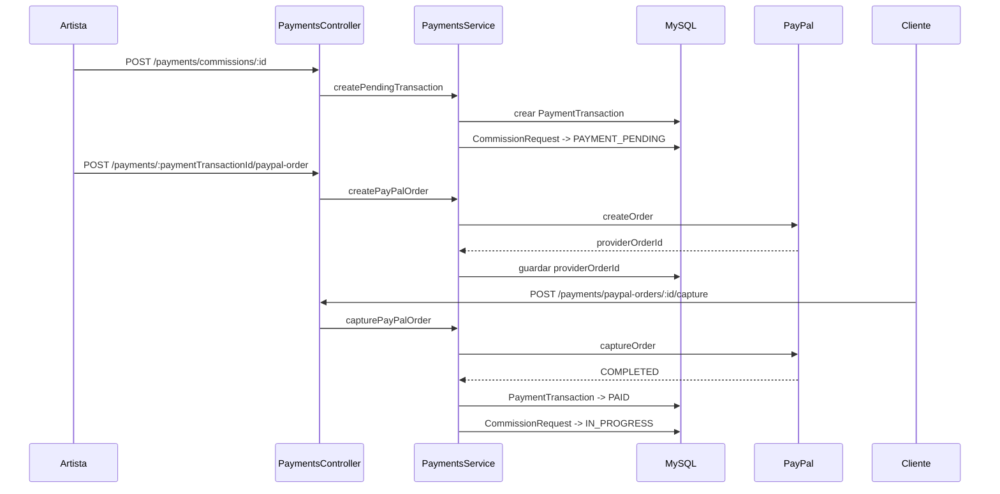

### 7.6 Entrega protegida de comision

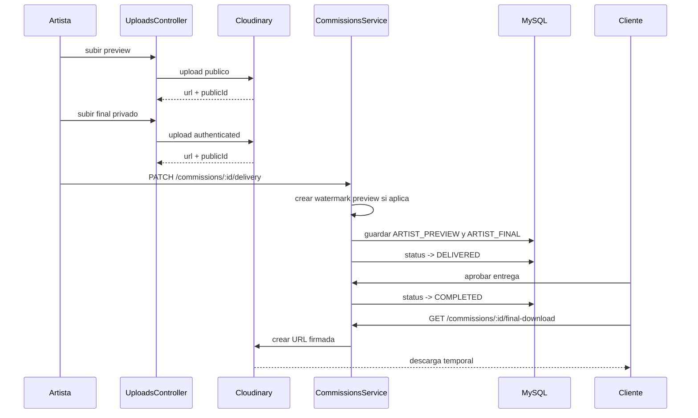

### 7.7 Bolsa de trabajo hacia comision

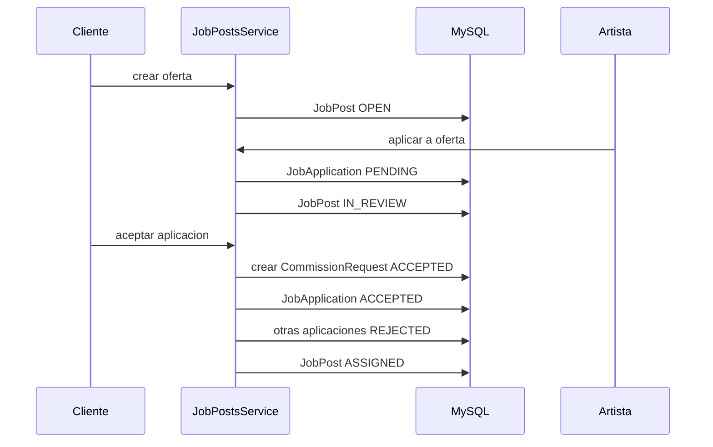

### 7.8 Marketplace digital

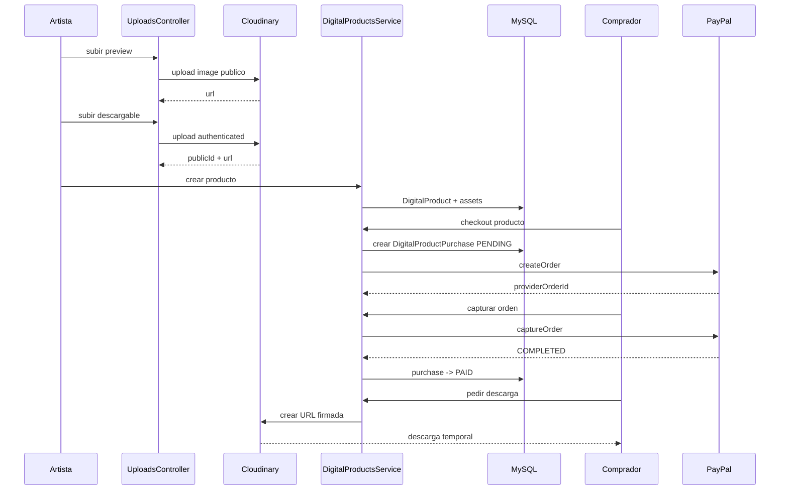

## 8. Modulos del backend

### 8.1 AuthModule

Responsabilidad:

- registro;
- login;
- verificacion de email;
- reenvio de verificacion;
- endpoint `/auth/me`;
- generacion de JWT.

Endpoints:

- `POST /auth/register`
- `POST /auth/login`
- `GET /auth/verify-email`
- `POST /auth/resend-verification`
- `GET /auth/me`

Estructura:

- `AuthController`: expone rutas.
- `AuthService`: maneja reglas de auth.
- `JwtStrategy`: extrae y valida token.
- `JwtAuthGuard`: protege rutas.

Decisiones:

- La contrasena nunca se guarda plana. Se guarda `passwordHash`.
- El login exige correo verificado.
- El rol inicial es `CLIENT`.
- Crear perfil artistico despues puede cambiar rol a `ARTIST`.

### 8.2 ArtistsModule

Responsabilidad:

- listar artistas;
- ver perfil publico;
- crear perfil propio;
- editar perfil propio;
- calcular metricas.

Endpoints:

- `GET /artists`
- `GET /artists/:id`
- `POST /artists/me`
- `PATCH /artists/me`
- `GET /artists/me/metrics`

Decisiones:

- El perfil publico esta separado del usuario privado.
- La categoria se valida por id.
- Las metricas se calculan desde portfolio.
- Si un usuario crea perfil, su rol pasa a `ARTIST`.

### 8.3 PortfolioModule

Responsabilidad:

- CRUD de obras;
- likes;
- vistas;
- detalle publico.

Endpoints:

- `GET /portfolio`
- `GET /portfolio/:id`
- `POST /portfolio/:id/view`
- `GET /portfolio/:id/like-status`
- `POST /portfolio/:id/like`
- `POST /portfolio`
- `PATCH /portfolio/:id`
- `DELETE /portfolio/:id`

Decisiones:

- Solo el dueno puede editar o borrar.
- Likes tienen constraint unico.
- `likeCount` y `viewCount` se guardan en el item para consultas rapidas.
- Cada obra puede tener multiples `PortfolioAsset`.
- El primer asset se usa como portada tecnica para listados.
- Editar una obra reemplaza sus assets en una transaccion.
- Al dar like a obra ajena, se crea notificacion.

### 8.4 UploadsModule y CloudinaryModule

Responsabilidad:

- recibir archivos desde frontend;
- validar archivo y tamano;
- subir a Cloudinary;
- devolver metadata normalizada.

Endpoints:

- `POST /uploads/image`
- `POST /uploads/file`
- `POST /uploads/portfolio`
- `POST /uploads/commission-final`
- `POST /uploads/digital-product`

Estructura de respuesta:

```json
{
  "url": "https://...",
  "publicId": "atrium/...",
  "resourceType": "image",
  "deliveryType": "authenticated",
  "name": "archivo.pdf",
  "mimeType": "application/pdf",
  "width": 1200,
  "height": 800,
  "format": "jpg",
  "bytes": 123456
}
```

Decisiones:

- Las imagenes publicas van a `atrium/uploads`.
- Los archivos generales tienen limite 15 MB.
- Los archivos de portafolio aceptan imagen, video o PDF y tienen limite 50 MB.
- Los finales de comision son privados y tienen limite 50 MB.
- Los productos digitales son privados, aceptan imagenes, videos, PDFs y paquetes descargables como `.zip`, `.rar` o `.7z`, con limite 100 MB.
- Para privados se usa `type: authenticated`.

### 8.5 CommissionsModule

Responsabilidad:

- solicitudes;
- propuestas;
- aceptacion;
- pagos;
- entregas;
- revisiones;
- cancelaciones;
- disputas;
- descargas finales.

Endpoints principales:

- `POST /commissions/artists/:artistProfileId`
- `GET /commissions/me`
- `GET /commissions/client/me`
- `PATCH /commissions/:id/status`
- `PATCH /commissions/:id/proposal`
- `PATCH /commissions/client/:id/proposal-response`
- `PATCH /commissions/:id/delivery`
- `PATCH /commissions/client/:id/delivery-response`
- `GET /commissions/:id/final-download`
- `PATCH /commissions/:id/cancel`
- `PATCH /commissions/client/:id/cancel`
- `PATCH /commissions/:id/dispute`
- `PATCH /commissions/client/:id/dispute`
- `PATCH /commissions/disputes/:id/resolve`

Estructuras importantes:

- `getCommissionSummaryInclude`: include compartido para respuestas de comision.
- `normalizeAttachmentInputs`: normaliza adjuntos.
- `withWatermarkPreview`: genera preview con watermark para imagenes.
- `hideLockedFinalFile`: oculta archivos finales si no estan desbloqueados.
- `autoCompleteExpiredDeliveries`: aprueba entregas vencidas.
- `ensureOwnsCommissionRequest`: valida propiedad artista.
- `ensureClientOwnsCommissionRequest`: valida propiedad cliente.

Decisiones:

- Toda accion sensible valida propiedad en backend.
- El archivo final nunca se expone al cliente antes de completar.
- Se mantiene compatibilidad con `deliveryPreviewUrl` y `finalFileUrl`.
- El flujo nuevo usa `CommissionAttachment`.
- Una disputa bloquea flujo normal y cambia estado a `DISPUTED`.
- La resolucion admin se expone desde `AdminModule` y queda auditada.

### 8.6 PaymentsModule

Responsabilidad:

- pagos de comision;
- pagos de revision extra;
- ordenes PayPal;
- captura PayPal;
- consulta de checkout.

Endpoints:

- `POST /payments/commissions/:commissionRequestId`
- `GET /payments/me`
- `POST /payments/:paymentTransactionId/paypal-order`
- `GET /payments/checkout/:providerOrderId`
- `POST /payments/paypal-orders/:paypalOrderId/capture`

Decisiones:

- `PaymentTransaction` esta ligado a `CommissionRequest`.
- Un pago principal solo se crea cuando la comision esta `ACCEPTED`.
- Al crear pago, la comision pasa a `PAYMENT_PENDING`.
- Al capturar pago principal, pasa a `IN_PROGRESS`.
- `releasedAt` marca liberacion logica, no transferencia bancaria real.
- La creacion/captura PayPal usa `PayPalService` compartido para no duplicar SDK y manejo de errores.

### 8.7 JobPostsModule

Responsabilidad:

- publicar ofertas;
- aplicar a ofertas;
- gestionar aplicaciones;
- convertir aplicacion aceptada en comision.

Endpoints:

- `GET /job-posts`
- `POST /job-posts`
- `GET /job-posts/me`
- `PATCH /job-posts/:id`
- `PATCH /job-posts/:id/status`
- `GET /job-posts/applications/me`
- `POST /job-posts/:id/applications`
- `PATCH /job-posts/applications/:id/status`
- `PATCH /job-posts/applications/:id/withdraw`

Decisiones:

- Cualquier usuario puede publicar oferta.
- Un artista no puede aplicar a su propia oferta.
- Fechas pasadas se rechazan.
- Presupuesto minimo y maximo se validan.
- Aceptar una aplicacion crea una comision.
- La oferta queda `ASSIGNED`.
- Las demas aplicaciones pendientes se rechazan.

### 8.8 DigitalProductsModule

Responsabilidad:

- productos digitales;
- assets preview/descarga;
- compras PayPal;
- biblioteca;
- descargas firmadas.

Endpoints:

- `GET /digital-products`
- `GET /digital-products/me`
- `POST /digital-products`
- `PATCH /digital-products/:id`
- `POST /digital-products/:id/checkout`
- `GET /digital-products/checkout/:providerOrderId`
- `POST /digital-products/paypal-orders/:paypalOrderId/capture`
- `GET /digital-products/purchases/me`
- `GET /digital-products/purchases/:id/download`

Estructuras importantes:

- `DigitalProductStatus`: controla visibilidad.
- `DigitalProductAssetKind`: separa preview de descarga.
- `DigitalProductPurchaseStatus`: controla desbloqueo.
- `hideDownloadAssetUrls`: evita exponer descargables.
- `createSignedDownloadUrl`: da acceso temporal.

Decisiones:

- Los productos publicados requieren al menos un descargable.
- El vendedor no puede comprar su propio producto.
- El comprador solo descarga si purchase esta `PAID`.
- Los archivos descargables son privados por defecto.
- Los descargables pueden ser paquetes creativos, por ejemplo pinceles, presets, partituras o archivos comprimidos.
- Marketplace no usa `PaymentTransaction` para no mezclar reglas con comisiones.
- Marketplace reutiliza `PayPalService` para crear y capturar ordenes.

### 8.9 AdminModule

Responsabilidad:

- resumen operativo;
- usuarios;
- artistas;
- obras;
- comisiones;
- disputas;
- pagos;
- ofertas;
- productos digitales;
- auditoria.

Endpoints:

- `GET /admin/summary`
- `GET /admin/users`
- `PATCH /admin/users/:id`
- `GET /admin/artists`
- `PATCH /admin/artists/:id`
- `GET /admin/portfolio-items`
- `PATCH /admin/portfolio-items/:id`
- `GET /admin/commissions`
- `GET /admin/disputes`
- `PATCH /admin/disputes/:id`
- `GET /admin/payments`
- `GET /admin/job-posts`
- `PATCH /admin/job-posts/:id`
- `GET /admin/digital-products`
- `PATCH /admin/digital-products/:id`
- `GET /admin/logs`

Estructuras importantes:

- `RolesGuard`: bloquea rutas por rol.
- `@Roles('ADMIN')`: marca controllers o handlers de admin.
- `AdminActionLog`: registra acciones sensibles.
- `isSuspended`: corta acceso de usuarios suspendidos.
- `isHidden`: oculta artista u obra sin borrar datos.

Decisiones:

- No se creo un CMS complejo. El panel admin solo cubre operacion real.
- Suspender usuario invalida el siguiente uso del JWT porque `JwtStrategy` consulta estado.
- Ocultar contenido conserva historial, pagos y relaciones.
- Resolver disputa desde admin reutiliza `CommissionsService` para no duplicar reglas.
- Cada accion administrativa relevante escribe un log persistente.

### 8.10 ReviewsModule

Responsabilidad:

- reviews de cliente a artista;
- reviews de artista a cliente.

Endpoints:

- `POST /reviews`
- `POST /reviews/clients`
- `GET /reviews/artists/:artistProfileId`

Decisiones:

- Solo se puede calificar comision completada.
- Solo una review por comision.
- Rating entre 1 y 5.
- Comentario obligatorio.
- El artista tambien puede calificar al cliente.

### 8.11 NotificationsModule

Responsabilidad:

- listar notificaciones propias;
- marcar una como leida;
- marcar todas como leidas.

Endpoints:

- `GET /notifications/me`
- `PATCH /notifications/:id/read`
- `PATCH /notifications/read-all`

Decisiones:

- Solo el dueno puede modificar sus notificaciones.
- Se devuelven ultimas 20 para mantener dashboards ligeros.
- Las notificaciones se crean desde otros services en transacciones relevantes.

### 8.12 MailModule

Responsabilidad:

- enviar correos transaccionales.

Correos actuales:

- verificacion de cuenta;
- solicitud de comision;
- revision de solicitud;
- propuesta recibida;
- solicitud rechazada;
- link de pago;
- entrega lista;
- aplicacion a oferta;
- decision de aplicacion;
- aplicacion retirada.

Decisiones:

- `MailService` centraliza proveedores.
- Resend tiene prioridad si esta configurado.
- SMTP es fallback.
- Si no hay correo para eventos no criticos, se loggea y no rompe flujo.
- Para registro si se exige correo configurado porque la cuenta depende de verificacion.

### 8.13 ArtistCategoriesModule

Responsabilidad:

- listar categorias.

Endpoint:

- `GET /artist-categories`

Decision:

Categorias normalizadas permiten filtros limpios y evitan texto duplicado.

## 9. Seguridad actual

### 9.1 Mecanismos existentes

- Passwords con bcrypt.
- JWT para sesiones.
- Email verification.
- `JwtAuthGuard` en rutas privadas.
- `RolesGuard` para rutas exclusivas de admin.
- Ownership checks en services.
- Bloqueo de cuentas suspendidas desde `JwtStrategy`.
- Ocultamiento administrativo de perfiles y obras.
- Archivos finales ocultos antes de aprobacion.
- Productos digitales con descarga firmada.
- Cloudinary authenticated para archivos privados.
- Auditoria persistente con `AdminActionLog`.
- Validaciones manuales de estado.
- Validaciones manuales de montos y fechas.

### 9.2 Ejemplos de ownership

- Solo el artista dueno edita su perfil.
- Solo el artista dueno edita una obra.
- Solo el artista asignado modifica una comision.
- Solo el cliente dueno responde una comision.
- Solo comprador descarga producto digital.
- Solo usuario dueno marca notificacion como leida.
- Solo admin entra a `/admin`.
- Solo admin puede suspender usuarios, ocultar contenido y resolver disputas desde panel.

### 9.3 Pendientes de seguridad

- `@nestjs/throttler` para rate limiting.
- `helmet`.
- `ValidationPipe` global.
- DTOs con `class-validator`.
- Refresh tokens.
- Sanitizacion mas estricta de inputs.
- MIME whitelist por endpoint.

## 10. Decisiones de diseno importantes

### 10.1 Usuario y artista separados

Se separo `User` de `ArtistProfile` porque una cuenta puede actuar como cliente y artista. Esto evita bloquear funciones segun una sola etiqueta de rol.

### 10.2 Comision y oferta separadas

`JobPost` sirve para seleccion. `CommissionRequest` sirve para ejecucion.

Esto evita que una oferta tenga que cargar estados de entrega, pagos, revisiones y disputas antes de que exista un acuerdo real.

### 10.3 Adjuntos como tabla separada

Los adjuntos multiples no caben bien en campos sueltos. `CommissionAttachment` y `DigitalProductAsset` permiten escalar archivos por tipo, guardar metadata y controlar privacidad.

### 10.4 Pagos de comision y compras digitales separados

`PaymentTransaction` pertenece a comisiones. `DigitalProductPurchase` pertenece a marketplace.

Esto evita un modelo generico lleno de campos opcionales y reglas mezcladas.

### 10.5 URLs firmadas

Los archivos sensibles no deben exponerse por URL permanente. El backend verifica permisos y luego genera URL temporal.

Esto aplica a:

- finales de comision;
- productos digitales descargables.

### 10.6 Watermark en previews

El cliente debe poder revisar avances sin recibir el archivo limpio antes de aprobar. El watermark reduce riesgo de uso indebido.

### 10.7 Transacciones Prisma

Se usan transacciones cuando una accion modifica varias tablas.

Ejemplos:

- crear comision y notificacion;
- aceptar aplicacion y crear comision;
- capturar pago y cambiar estado;
- abrir disputa y adjuntar evidencia;
- cancelar comision y actualizar pagos.

Esto evita estados intermedios inconsistentes.

## 11. Relaciones de datos por dominio

### 11.1 Identidad

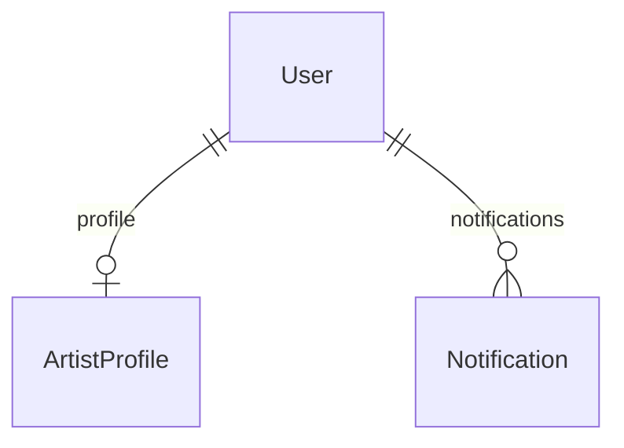

### 11.2 Portafolio

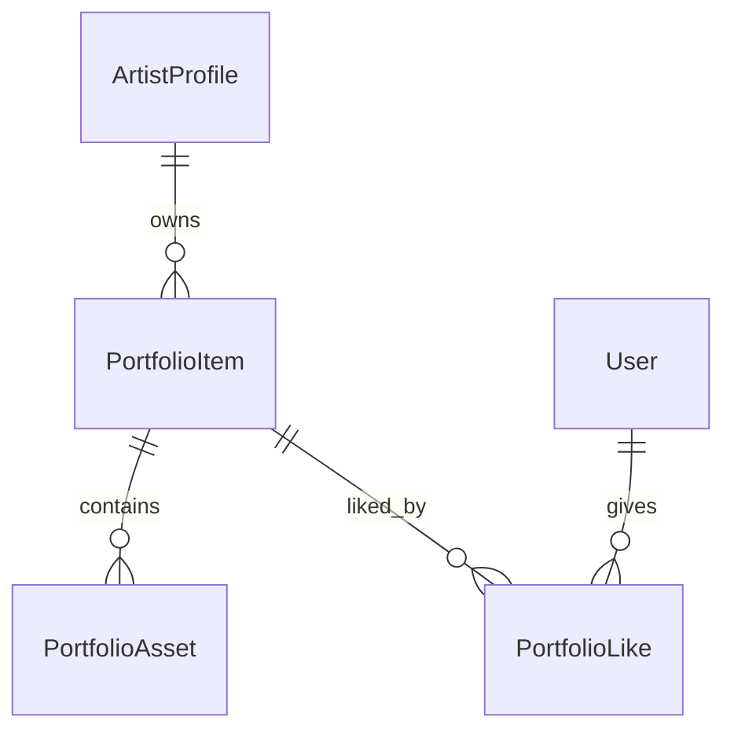

### 11.3 Comisiones

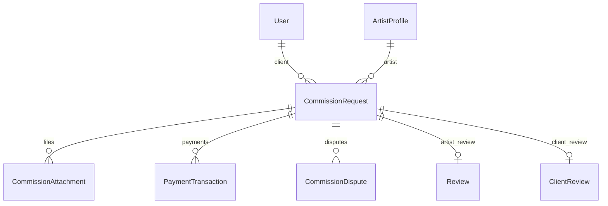

### 11.4 Bolsa de trabajo

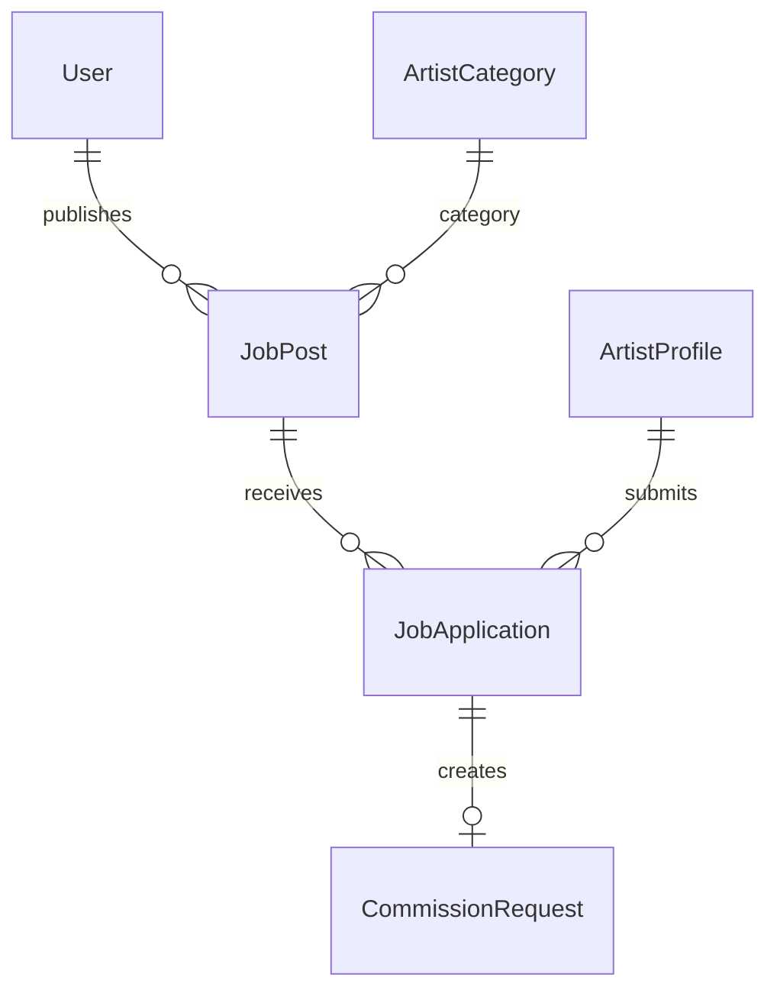

### 11.5 Marketplace

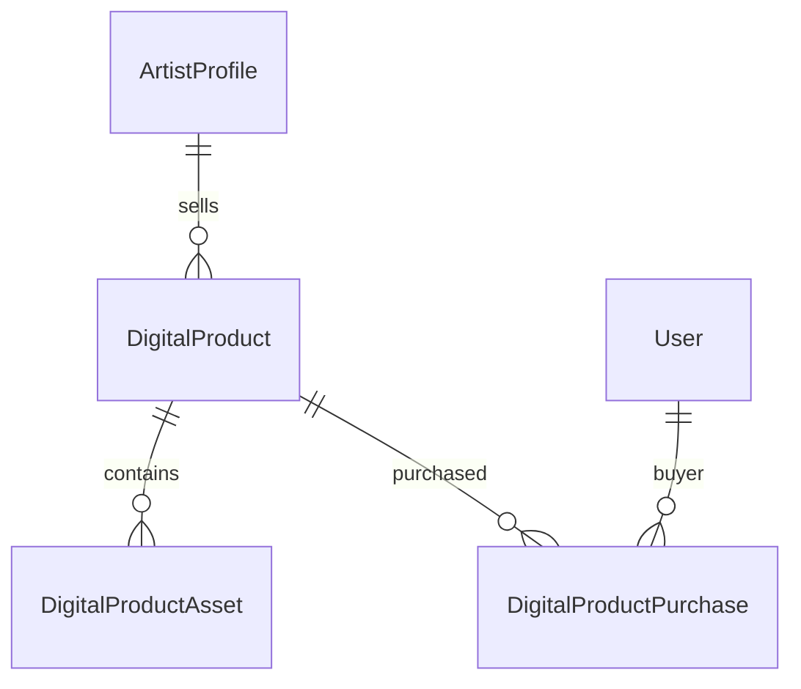

### 11.6 Administracion

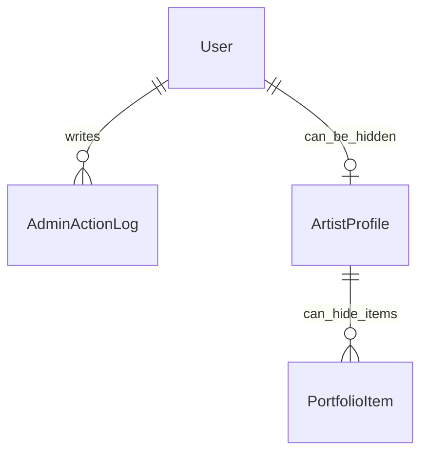

El admin no tiene tablas espejo para cada dominio. Opera sobre los modelos reales y deja rastro en `AdminActionLog`. Esta decision evita duplicar datos administrativos.

## 12. Variables de entorno importantes

Variables usadas o esperadas:

```text
DATABASE_URL
JWT_SECRET
FRONTEND_URL
PORT
NODE_ENV

CLOUDINARY_CLOUD_NAME
CLOUDINARY_API_KEY
CLOUDINARY_API_SECRET

PAYPAL_CLIENT_ID
PAYPAL_CLIENT_SECRET
PAYPAL_ENVIRONMENT

RESEND_API_KEY
RESEND_FROM
MAIL_FROM

SMTP_HOST
SMTP_PORT
SMTP_USER
SMTP_PASS
SMTP_SECURE
SMTP_REJECT_UNAUTHORIZED

COMMISSION_RESPONSE_DAYS
```

## 13. Migraciones importantes

Migraciones recientes relevantes:

- `20260616000000_add_protected_commission_delivery`
- `20260617000000_add_job_posts`
- `20260617001000_trim_job_post_statuses`
- `20260617002000_add_job_post_pause_close`
- `20260617003000_add_withdrawn_job_applications`
- `20260617004000_enhance_commission_flow`
- `20260617005000_add_commission_disputes_and_revision_payments`
- `20260617006000_private_final_downloads_and_watermark`
- `20260618000000_add_digital_marketplace`
- `20260618001000_add_admin_controls`
- `20260618002000_add_portfolio_assets`
- `20260618003000_trim_media_types`

Nota tecnica:

En este proyecto algunas migraciones se aplicaron con:

```bash
pnpm.cmd prisma db execute --file prisma/migrations/<migration>/migration.sql
pnpm.cmd prisma migrate resolve --applied <migration>
pnpm.cmd prisma generate
```

Esto se hizo porque `migrate dev` fallo antes por permisos de shadow DB. Es una decision pragmatica para entorno local. Para produccion conviene usar `prisma migrate deploy`.

## 14. Endpoints principales

### Auth

```text
POST /auth/register
POST /auth/login
GET  /auth/verify-email
POST /auth/resend-verification
GET  /auth/me
```

### Artists

```text
GET   /artists
GET   /artists/:id
POST  /artists/me
PATCH /artists/me
GET   /artists/me/metrics
```

### Portfolio

```text
GET    /portfolio
GET    /portfolio/:id
POST   /portfolio/:id/view
GET    /portfolio/:id/like-status
POST   /portfolio/:id/like
POST   /portfolio
PATCH  /portfolio/:id
DELETE /portfolio/:id
```

### Uploads

```text
POST /uploads/image
POST /uploads/file
POST /uploads/portfolio
POST /uploads/commission-final
POST /uploads/digital-product
```

### Commissions

```text
POST  /commissions/artists/:artistProfileId
GET   /commissions/me
GET   /commissions/client/me
GET   /commissions/proposals/:id
PATCH /commissions/proposals/:id/response
PATCH /commissions/client/:id/proposal-response
GET   /commissions/deliveries/:id
PATCH /commissions/deliveries/:id/response
PATCH /commissions/client/:id/delivery-response
GET   /commissions/:id/final-download
PATCH /commissions/client/:id/cancel
PATCH /commissions/:id/cancel
PATCH /commissions/client/:id/dispute
PATCH /commissions/:id/dispute
PATCH /commissions/disputes/:id/resolve
PATCH /commissions/:id/status
PATCH /commissions/:id/note
PATCH /commissions/:id/proposal
PATCH /commissions/:id/delivery
```

### Payments

```text
POST /payments/commissions/:commissionRequestId
GET  /payments/me
GET  /payments/checkout/:providerOrderId
POST /payments/paypal-orders/:paypalOrderId/capture
POST /payments/:paymentTransactionId/paypal-order
```

### Job Posts

```text
GET   /job-posts
POST  /job-posts
GET   /job-posts/me
PATCH /job-posts/:id
PATCH /job-posts/:id/status
GET   /job-posts/applications/me
PATCH /job-posts/applications/:id/status
PATCH /job-posts/applications/:id/withdraw
POST  /job-posts/:id/applications
```

### Digital Products

```text
GET   /digital-products
GET   /digital-products/me
POST  /digital-products
PATCH /digital-products/:id
POST  /digital-products/:id/checkout
GET   /digital-products/checkout/:providerOrderId
POST  /digital-products/paypal-orders/:paypalOrderId/capture
GET   /digital-products/purchases/me
GET   /digital-products/purchases/:id/download
```

### Admin

```text
GET   /admin/summary
GET   /admin/users
PATCH /admin/users/:id
GET   /admin/artists
PATCH /admin/artists/:id
GET   /admin/portfolio-items
PATCH /admin/portfolio-items/:id
GET   /admin/commissions
GET   /admin/disputes
PATCH /admin/disputes/:id
GET   /admin/payments
GET   /admin/job-posts
PATCH /admin/job-posts/:id
GET   /admin/digital-products
PATCH /admin/digital-products/:id
GET   /admin/logs
```

### Notifications

```text
GET   /notifications/me
PATCH /notifications/read-all
PATCH /notifications/:id/read
```

### Reviews

```text
POST /reviews
POST /reviews/clients
GET  /reviews/artists/:artistProfileId
```

### Categories

```text
GET /artist-categories
```

## 15. Estado actual y proximos pasos

### Funcional actualmente

- Registro/login/JWT.
- Verificacion de correo.
- Perfil artistico.
- Portafolio multimedia avanzado.
- Multiples imagenes, videos y PDFs por publicacion.
- Likes y vistas.
- Solicitudes de comision.
- Adjuntos de referencia.
- Propuestas.
- Revisiones incluidas y extra.
- Pagos PayPal de comision.
- Entregas con previews y finales privados.
- Watermark.
- Descarga firmada.
- Autoaprobacion.
- Cancelaciones.
- Disputas basicas.
- Reviews.
- Bolsa de trabajo.
- Conversion oferta a comision.
- Marketplace digital.
- Compras digitales PayPal.
- Biblioteca de compras.
- Descargas firmadas de productos.
- Panel admin `/admin`.
- Suspension de usuarios.
- Ocultamiento de artistas y obras.
- Resolucion admin de disputas.
- Auditoria basica de acciones admin.
- Notificaciones.
- Emails.

### Pendiente para cerrar backend de producto ampliado

1. Seguridad avanzada:
   - rate limiting;
   - helmet;
   - DTO validation;
   - refresh tokens;
   - MIME whitelist por endpoint.

2. Membresias:
   - planes mensuales;
   - suscripciones;
   - contenido desbloqueado por plan.

3. Follow y discovery:
   - seguir artistas;
   - actividad reciente;
   - base para feed futuro.

4. DevOps:
   - `.env.example` final;
   - backups;
   - deploy docs;
   - health checks;
   - logs estructurados.

## 16. Conclusion tecnica

El backend de Atrium esta construido con una arquitectura pragmatica y extensible. La decision mas importante fue separar dominios reales del producto en modulos independientes:

- identidad;
- perfil;
- portafolio;
- comisiones;
- ofertas;
- pagos;
- marketplace;
- media;
- reviews;
- notificaciones;
- administracion.

Esto permite seguir creciendo sin convertir el backend en un archivo unico lleno de condicionales.

La base de datos refleja las reglas del producto. No solo guarda contenido: modela relaciones de confianza, pagos, entregas, propiedad, compras y estados. Esa es la razon por la que el esquema tiene varias entidades en lugar de una estructura generica.

La combinacion NestJS + Prisma + MySQL + Cloudinary + PayPal es adecuada para Atrium porque cubre las necesidades centrales del producto:

- API modular;
- datos relacionales;
- media externa;
- pagos;
- correo;
- permisos;
- descargas protegidas.

El backend ya soporta la mayor parte del producto ampliado. Lo que falta no es rehacer la arquitectura, sino completar capas de control, seguridad y experiencia operacional.
