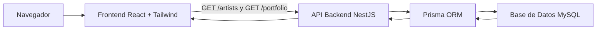

# Progreso de Atrium - Semana 5

## Objetivo actual

Atrium se está desarrollando como una plataforma multimedia para artistas y creativos. El objetivo actual es construir una base full-stack limpia antes de agregar cargas de portafolio, eventos, comisiones, likes y vistas.

## Estructura actual del proyecto

```txt
atrium/
  frontend/
  backend/
  docs/
```

## Progreso del frontend

Tecnología:
- React
- Tailwind CSS
- Vite
- pnpm

Implementado:
- Layout de página de inicio
- Componente reutilizable Button
- Componente reutilizable ArtistCard
- Componente reutilizable PortfolioItemCard
- Datos de artistas cargados desde la API del backend
- Portafolio destacado cargado desde la API del backend
- Página pública de detalle de artista
- Estados de carga y error para solicitudes a la API

## Progreso del backend

Tecnología:
- NestJS
- Prisma
- MySQL
- pnpm

Implementado:
- Aplicación backend con NestJS
- Conexión de Prisma a MySQL
- PrismaService y PrismaModule
- Módulo artists
- Módulo portfolio
- Módulo auth
- GET /artists
- GET /artists/:id
- GET /portfolio
- POST /auth/register
- POST /auth/login
- GET /auth/me

## Progreso de base de datos

Base de datos creada:

```txt
atrium_db
```

Tablas creadas:
- User
- ArtistProfile
- PortfolioItem
- _prisma_migrations

Relaciones actuales:
- Un User tiene un ArtistProfile.
- Un ArtistProfile pertenece a un User.
- Un ArtistProfile tiene muchos PortfolioItems.
- Un PortfolioItem pertenece a un ArtistProfile.

## Flujo actual de datos

```txt
MySQL
  -> Prisma
  -> NestJS GET /artists, GET /artists/:id y GET /portfolio
  -> React fetch()
  -> componentes ArtistCard y PortfolioItemCard
```

## Diagrama de Arquitectura



## Flujo de demo actual

1. Iniciar el backend.

```powershell
cd backend
pnpm.cmd start:dev
```

2. Probar la API.

```txt
http://localhost:3000/artists
http://localhost:3000/portfolio
```

3. Iniciar el frontend.

```powershell
cd frontend
pnpm.cmd dev
```

4. Abrir la aplicación.

```txt
http://localhost:5173/
```

5. Mostrar que las tarjetas de artistas y portafolio se cargan desde MySQL por medio del backend.

## Checklist para la Presentación del Viernes

### Demo

- Iniciar el backend con `pnpm.cmd start:dev`.
- Mostrar `http://localhost:3000/`.
- Mostrar `http://localhost:3000/artists`.
- Mostrar `http://localhost:3000/portfolio`.
- Iniciar el frontend con `pnpm.cmd dev`.
- Mostrar `http://localhost:5173/`.
- Mostrar una página pública de artista como `http://localhost:5173/artists/1`.
- Explicar que las tarjetas se cargan desde MySQL a través de la API backend.

### Código para mostrar

- `backend/prisma/schema.prisma`
- `backend/src/artists/artists.controller.ts`
- `backend/src/artists/artists.service.ts`
- `backend/src/portfolio/portfolio.controller.ts`
- `backend/src/portfolio/portfolio.service.ts`
- `backend/src/auth/auth.controller.ts`
- `backend/src/auth/auth.service.ts`
- `backend/src/prisma/prisma.service.ts`
- `frontend/src/pages/HomePage.jsx`
- `frontend/src/pages/ArtistDetailPage.jsx`
- `frontend/src/components/ArtistCard.jsx`
- `frontend/src/components/PortfolioItemCard.jsx`

### Conceptos para explicar

- Estructura monorepo
- Backend como monolito modular
- Modelos y migraciones de Prisma
- Relación uno a uno entre User y ArtistProfile
- Relación uno a muchos entre ArtistProfile y PortfolioItem
- Endpoints `GET /artists`, `GET /artists/:id` y `GET /portfolio`
- Endpoints de auth `POST /auth/register`, `POST /auth/login` y `GET /auth/me`
- Estado de React y `useEffect`
- Estados de carga y error

## Próximos pasos del MVP

Semana 6:
- Crear páginas frontend de login y register.
- Crear una página dashboard básica.
- Agregar formulario para crear PortfolioItem.
- Empezar a planificar soporte para Cloudinary.

Semana 7:
- Agregar modelo y endpoints de eventos.
- Mostrar eventos promocionados en el frontend.

Semana 8:
- Agregar modelo y formulario de CommissionRequest.
- Agregar likes y vistas básicos si el tiempo lo permite.

Semana 9:
- Pulir la UI.
- Probar el flujo completo de demo.
- Preparar la presentación del MVP.
